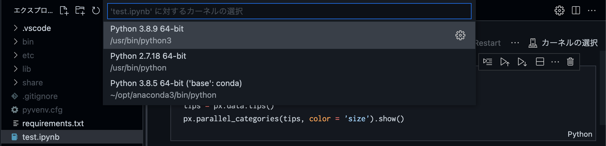

# jupyter notebook with vs code

jupyter notebook を vscodeで使用する方法

----

1. virtualenvをインストールする
   
    > 似たようなライブラリがたくさんあるけどvirtualenvが使い易い

    > gitignoreの設定が最初からされている

    ```bash
    #  初回のみ
    pip install virtualenv
    ```

1. 仮想環境に入るためのファイルを作成

    ```bash
    # プロジェクト名はない方が扱いやすい
    virtualenv (プロジェクト名)
    # or
    virtualenv .
    ```
  
1. 仮想環境に入る

    ```bash
    source bin/activate
    ```

    > 仮想環境に入った状態でpip install (ライブラリ)で環境が分離される

   - 仮想環境から出る

      ```bash
      deactivate
      ```

1. Jupyterのパッケージをインストール

    ```bash
    pip install jupyter

    pip install pandas lxml plotly-express
    ```

1. パッケージをインストール後はrequirements.txtに書き出す
  
    > git clone 後に、簡単にパッケージをインストールするために必要

    ```
    pip freeze > requirements.txt
    ```
  
2. 設定ファイルを追加する

    .vscode/settings.jsonファイルを作成し、内容を以下の通りにする

    ```json
    {
      // PythonのPATHをワークスペースの仮想環境にする
      "python.pythonPath" : "${workspaceFolder}/venv/bin/python",
      // 仮想環境にインストールしたファイルは監視対象から除外する
      "files.watcherExclude" : {
          "**/venv/**" : true
      }
    }
    ```

3. ファイルを作成する

    hello.ipynbファイルを作成する

    ```py
    import plotly.express as px
 
    tips = px.data.tips()
    px.parallel_categories(tips, color = 'size').show()
    ```

    実行する

    実行時の選択肢は現在のプロジェクトを選択

    

     結果

    

# git clone 後の処理

1. virtualenvを作成

    ```bash
    virtualenv .
    ```

1. requirement.txtからpipでパッケージを入れる

    ```bash
    pip install -r requirements.txt
    ```


